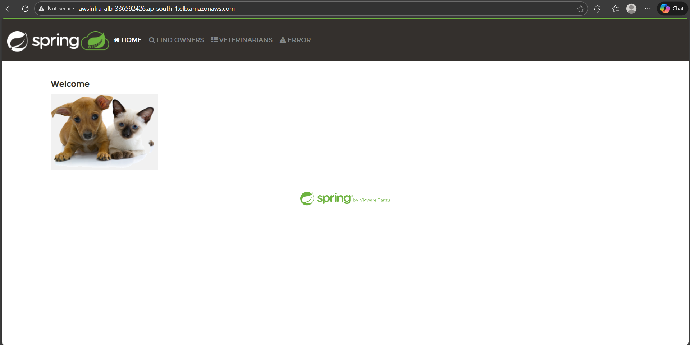

# AWS Infrastructure Automation Using Terraform

## 📌 Project Overview
Organizations deploying containerized applications to the cloud require an infrastructure that is **scalable, highly available, secure, and repeatable**. Manually provisioning such environments is time-consuming, error-prone, and difficult to manage at scale.

This project demonstrates how **Infrastructure as Code (IaC)** using **Terraform** can be used to fully automate the deployment of a production-ready AWS infrastructure. The solution provisions networking, compute, load balancing, database, and security components in a modular and reusable manner.

---

## 🎯 Objectives
- Automate AWS infrastructure provisioning using Terraform
- Deploy containerized applications using ECS (EC2 launch type)
- Implement secure networking with VPC, subnets, and security groups
- Enable high availability using Application Load Balancer and Auto Scaling
- Use RDS for persistent database storage
- Manage Terraform state remotely using Amazon S3

---

## 🏗️ Architecture Components
- **VPC** with public and private subnets across multiple Availability Zones
- **Internet Gateway & NAT Gateway** for controlled internet access
- **Application Load Balancer (ALB)** for traffic distribution
- **ECS Cluster (EC2 launch type)** for containerized application hosting
- **Auto Scaling Group (ASG)** for dynamic scaling
- **RDS (MySQL/PostgreSQL)** for persistent data storage
- **IAM Roles & Security Groups** for secure access control
- **Terraform Remote Backend (S3)** for state management

---

## 📂 Project Structure
spring-app/
│
├── main/
│ ├── main.tf
│ ├── variables.tf
│ ├── terraform.tfvars
│ ├── outputs.tf
│ ├── statefile.tf
│ ├── userdata.sh
│ └── terraform.lock.hcl
│
├── modules/
│ ├── vpc/
│ ├── natgateway/
│ ├── security_group/
│ ├── alb/
│ ├── ec2/
│ ├── asg/
│ └── rds/
│
└── README.md


### 📌 Structure Highlights
- **Root module** orchestrates all infrastructure components
- **Modules** follow a single-responsibility design
- **userdata.sh** automates application bootstrap on EC2 instances

---

## ⚙️ Prerequisites
- AWS Account
- Terraform (v1.x or later)
- AWS CLI
- Git
- Valid AWS credentials configured using:
```bash
aws configure
```

Verify access:
```bash
aws sts get-caller-identity
```

## 🚀 Steps to Use the Project

Step 1: Clone the Project

```bash
git clone <repository-url>
cd springapp_terraform/main
```

Step 2: Configure Backend

- Ensure the S3 bucket for Terraform state already exists
- Verify statefile.tf backend configuration
- Backend provides centralized state and locking

Step 3: Update Variables

Edit terraform.tfvars to set:
- AWS region
- Project name
- CIDR blocks
- Subnet configuration (Ensure Free Tier–eligible instance types are used)

Step 4: Initialize Terraform

```bash
terraform init
```

- This initializes providers, modules, and backend configuration.

Step 5: Validate Configuration

```bash
terraform validate
```

- Checks for syntax and logical errors.

Step 6: Review Execution Plan

```bash
terraform plan
```

- Displays resources to be created or modified before deployment.

Step 7: Deploy Infrastructure

```bash
terraform apply
```

Type yes when prompted.

Terraform provisions:
- VPC & networking
- Security groups
- ALB
- ECS cluster & ASG
- RDS database

Step 8: Verify Deployment

```bash
terraform output
```

Verify in AWS Console:

- EC2 instances are running
- ALB target groups are healthy
- RDS status is available

Step 9: Access Application

Copy the ALB DNS name from outputs
Open in browser:
http://<ALB-DNS-NAME>

